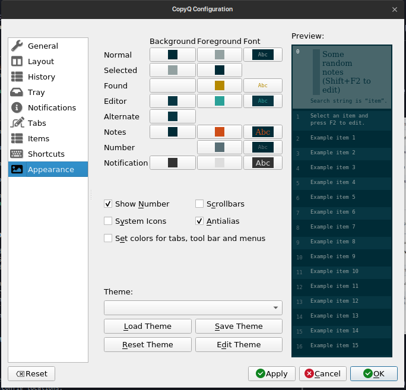
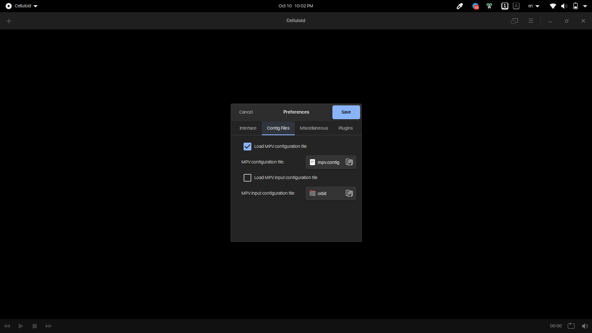

# Miscellaneous Linux Configs

### CopyQ

- `/copyq` directory
- Import ini file from the CopyQ UI.
- Screenshot:

  

### Tilix

- `/tilix` directory
- Dump config to file (example):

  ```sh
  dconf dump /com/gexperts/Tilix/ > tilix.dconf
  ```

- Load config from file (example):

  ```sh
  dconf load /com/gexperts/Tilix/ < tilix.dconf
  ```

- Screenshot (Click for sauce)

  [](https://github.com/gnunn1/tilix/issues/571)

  > Note: Custom background images may be missing

### ZSH + Oh My ZSH

- `/zsh` directory
- Profile location: `~/.zprofile`
- Default oh-my-zsh custom settings location: `~/.oh-my-zsh/custom`
- Exported:
  - Oh My ZSH
    - Aliases
    - Shortcuts (may not work outside source PC)
    - Themes
- `.zshrc` not exported because effort
- Use theme `px-rose-pine-mod`

  ```sh
  # Add this line to ~/.zshrc
  ZSH_THEME="px-rose-pine-mod"
  ```

### Visual Studio Code

- `/vscode` directory
- Default config locations:

  | Config             | Subdirectory  | Location                               |
  | ------------------ | ------------- | -------------------------------------- |
  | Keyboard Shortcuts | `keybindings` | `~/.config/Code/User/keybindings.json` |
  | Settings           | N/A           | `~/.config/Code/User/settings.json`    |

- Subdirectories map to file names. File extensions are kept as is.

  **Example:** A file called `2022-10-10.json` in the `keybindings` directory would be imported as `keybindings.json` into the `~/.config/Code/User/` directory

### Neovim

- `/nvim` directory
- Default config location: `~/.config/nvim`

### Alacritty

- `/alacritty` directory
- Default config location: `~/.config/alacritty`

### Miscellaneous

- `/misc` directory
- Convenience tweaks and configs
- Items:

  | File                  | Description                                                         | Instructions                               |
  | --------------------- | ------------------------------------------------------------------- | ------------------------------------------ |
  | `disable-tap-drag.sh` | Disables the double-tap to drag gesture on touchpads (GNOME only)   | Execute the shell script as admin          |
  | `mpv.config`          | Configurations for mpv that remove vertical tearing during playback | Load the config file from the Celluloid UI |

- Screenshots:

  - Celluloid config:

    
